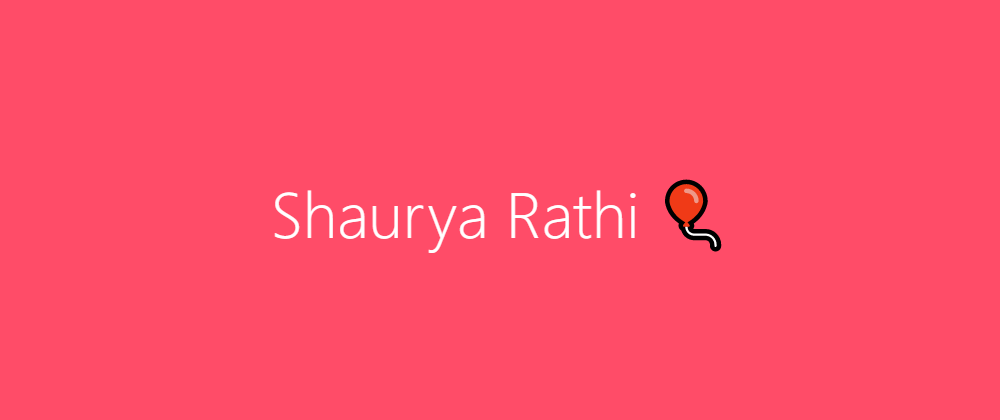

# Hello There 
Hello, My name is Shaurya Rathi and my nickname is iron coder. I am a FULL STACK DEVELOPER and I like to code and play tennis. My favourite colors is dark blue and cyan and I like Jokes 🤣

 

# Languages and Frameworks I code in:

 

    
  
    
    
    
    
    
     
     
    
    
    
    
    
    
    
    

 
 

# Github Stats 📉

<a href="https://github.com/Code2Rithik">
     
  
</a>

# Contact Me

<strong> Join My Discord Server</strong>
  
 
     
    <strong>Subscribe Me on Youtube!</strong>
     
    
  

